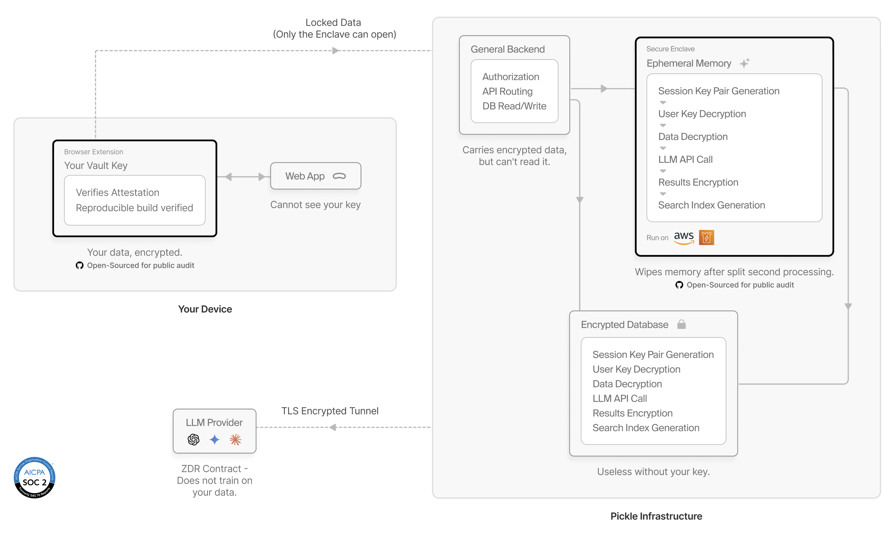

# Privacy by Proof

### The Verifiable Privacy Architecture of Pickle

> **Your digital memory is a sacred extension of your mind. We built an architecture that lets it move freely, without fear of being observed.**

This repository contains the **source code and reproducible builds** for the security-critical components of [Pickle](https://pickle.com): the verifiable privacy foundation that makes unauthorized access cryptographically infeasible, not just policy-prohibited.

---

## Architecture Overview



The architecture achieves what was previously thought impossible: **LLM-powered intelligence on your personal data, with the same privacy guarantees as end-to-end encrypted messaging**.

---

## The Industry Chose Convenience Over Privacy.

Every AI service that processes your personal data faces a fundamental dilemma:

| Approach                 | Limitation                                                      |
| ------------------------ | --------------------------------------------------------------- |
| End-to-end encryption    | Impossible — LLMs need plaintext to "understand" your data      |
| "We promise not to look" | Trust-based. Unverifiable. One policy change away from breaking |
| Database encryption      | Operators see data the moment the server decrypts               |
| Secure server setup      | It's still the operator who sets up that server                 |
| KMS-based encryption     | Operators with KMS access can still decrypt                     |

**Core problem**: Each approach solves one problem but creates another. Breaking this chain requires combining multiple mechanisms with **cryptographic independence**.

---

## We Built Something Different.

Our architecture makes operator access **cryptographically infeasible** under explicitly stated trust assumptions — not just discouraged by policy.

| Protection Target           | Method                                                        |
| --------------------------- | ------------------------------------------------------------- |
| From operators              | Decryption only in hardware-isolated Enclave + Ephemeral keys |
| From hackers                | Database contains only garbage without your key               |
| From LLM providers          | Zero Data Retention contract + TLS termination inside Enclave |
| Verifiability               | Open source + reproducible builds + hardware attestation      |
| Past data (Forward Secrecy) | Ephemeral keys not derived from any stored secret             |

---

## Don't Trust Us. Verify Us.

All security claims of this architecture are based on a simple premise:

> Through open source code + reproducible builds, it is verifiable that the installed browser extension and running Enclave are identical to the GitHub code.

| Component             | Role                                                            | Why Open Source                             | Verification Method                                    |
| --------------------- | --------------------------------------------------------------- | ------------------------------------------- | ------------------------------------------------------ |
| **Browser Extension** | Client-side trust anchor. Stores master key, verifies Enclaves. | **Must be verifiable** — holds your key     | Reproducible build → compare with store deployment     |
| **Desktop App**       | Client-side trust anchor. Stores master key, verifies Enclaves. | **Must be verifiable** — holds your key     | Reproducible build → compare with distributed binaries |
| **Enclave**           | Server-side trust anchor. Handles decryption, LLM calls.        | **Must be verifiable** — decrypts your data | Remote Attestation (ImageSha384)                       |
| **Web App**           | UI only. No key access.                                         | Trust not required                          | Cannot access your key by browser security model       |
| **General Backend**   | Auth, routing, byte relay only.                                 | Trust not required                          | Cannot decrypt your data (no key access)               |

**The security model doesn't require you to trust the closed-source components.** They are architecturally excluded from accessing sensitive data.

---

## Two Pillars of Verifiable Privacy

### Pillar 1: Zero Data Retention (ZDR)

**Nothing is kept longer than it needs to be.** Decryption happens only in volatile memory (RAM) for the split second the AI needs it. Once the task is done, the memory is wiped.

For LLM API calls, we enforce Zero Data Retention contracts with all providers:

| Provider           | Security Mechanism                                                 |
| ------------------ | ------------------------------------------------------------------ |
| OpenAI             | TLS terminates inside Enclave. Parent relays encrypted bytes only. |
| Anthropic          | TLS terminates inside Enclave. Parent relays encrypted bytes only. |
| Gemini (Vertex AI) | Same + Enclave verifies logging is disabled before calling         |
| Claude (Bedrock)   | Same + Enclave verifies logging is disabled before calling         |
| GPT/Claude (Azure) | Same + Enclave verifies logging is disabled before calling         |

**Critical invariant**: TLS terminates **inside** the Enclave. Parent instance and General Backend act as L4 (byte-level) proxies only — they relay encrypted traffic but cannot decrypt it.

### Pillar 2: Verifiable Code Execution

**Spying isn't just discouraged — it's impossible.** Every Enclave proves, cryptographically, exactly what code it's running. If anyone, including us, attempted to modify that code to observe your data, the proof would fail.

**Enclave (Server-side Trust Anchor)**:

- Uses AWS Nitro Enclaves — hardware-isolated execution environment
- Parent OS and operators cannot access Enclave memory
- Remote Attestation cryptographically proves what code is running
- Ephemeral keys generated at boot, not derived from any stored secret
- TLS for external services terminates inside the Enclave

**Browser Extension (Client-side Trust Anchor)**:

- Stores master key (`user_secret`) in extension-only storage
- Web app JavaScript structurally cannot access this storage (enforced by browser)
- Verifies Enclave's `ImageSha384` against `TRUSTED_HASHES` before sending any secrets
- Sends `user_secret` directly to each verified Enclave (no Enclave-to-Enclave propagation)

---

## You—and Only You—Hold the Keys.

The core innovation of this architecture is **Ephemeral Keys** that are cryptographically independent of any stored or retrievable secrets.

### Why Ephemeral Keys?

Traditional approaches derive encryption keys from a root secret stored in KMS:

```
❌ Traditional (Deterministic) Approach - VULNERABLE:

AWS KMS (S_root)
   │
   └── HKDF ──▶ (PK_enc, SK_enc)   ← Deterministic derivation

Problem:
- If operator changes KMS policy and retrieves S_root
- They can compute SK_enc
- All past Enc(PK_enc, user_secret) can be decrypted retroactively
```

Our architecture uses ephemeral keys:

```
✅ Ephemeral Key Approach - SECURE:

Enclave Instance Boot
   │
   └── Random Generation ──▶ (PK_eph, SK_eph)

   • SK_eph exists ONLY in Enclave RAM
   • SK_eph is NOT derived from any stored secret
   • SK_eph is NOT retrievable via KMS or any external system
   • When Enclave terminates, SK_eph is permanently destroyed
```

### Key Transfer Protocol

```
Extension                  General Backend              Enclave
   │                       + Parent Instance               │
   │                           │                           │
   │  1. Attestation request   │                           │
   │──────────────────────────▶│────── vsock ─────────────▶│
   │                           │                           │
   │  2. Attestation document (ImageSha384, PK_eph, AWS signature)
   │◀──────────────────────────│◀──────────────────────────│
   │                           │                           │
   │  3. Extension verification:                           │
   │     • Verify AWS signature (proves genuine Nitro)     │
   │     • ImageSha384 in TRUSTED_HASHES? (proves code)    │
   │     • If both pass, trust PK_eph                      │
   │                           │                           │
   │  4. Send Enc(PK_eph, user_secret)                     │
   │──────────────────────────▶│────── vsock ─────────────▶│
   │                           │                           │
   │     Backend/Parent        │      Decrypt with SK_eph  │
   │     relay ciphertext      │      → obtain user_secret │
   │     only (cannot decrypt) │      → derive K_user      │
```

### Forward Secrecy: Your Past Stays Protected.

Even if an attacker gains full access to all systems in the future:

| What Attacker Obtains                            | Can They Decrypt Past Data?                   |
| ------------------------------------------------ | --------------------------------------------- |
| Full database dump                               | ❌ No — encrypted with K_user they don't have |
| All logged ciphertext `Enc(PK_eph, user_secret)` | ❌ No — SK_eph no longer exists               |
| Full access to parent instance                   | ❌ No — Enclave RAM was hardware-isolated     |
| AWS account access                               | ❌ No — SK_eph was never stored anywhere      |

**This is Forward Secrecy**: Past communications remain secure even if future systems are compromised.

---

## Security Properties

| Property                           | How It's Achieved                                             |
| ---------------------------------- | ------------------------------------------------------------- |
| **Operators can't see your data**  | Decryption only happens in hardware-isolated Enclaves         |
| **Database breaches are useless**  | Encrypted data without keys is garbage                        |
| **Past data stays protected**      | Ephemeral keys are destroyed; no retroactive decryption       |
| **You can verify everything**      | Open source + reproducible builds + remote attestation        |
| **LLM providers don't store data** | Zero Data Retention contracts + TLS terminates inside Enclave |

---

## Trust Assumptions

We don't ask you to trust us blindly. We ask you to trust industry-standard foundations scrutinized by the global security community:

| Assumption                    | What We Trust                                                         |
| ----------------------------- | --------------------------------------------------------------------- |
| **AWS Nitro Enclaves**        | Hardware isolation is genuine; attestation signatures are unforgeable |
| **Browser Extension Storage** | Properly isolated from web pages per browser security model           |
| **Cryptographic Primitives**  | AES, ECDH, SHA-384, HKDF remain computationally secure                |
| **AWS Attestation PKI**       | AWS's signing keys are not compromised                                |
| **Your Device**               | Not compromised by malware that can extract extension storage         |

---

## Threat Model

### Threats Defended (Under Trust Assumptions)

| Threat                                | Defense Mechanism                                          |
| ------------------------------------- | ---------------------------------------------------------- |
| Operator viewing user data            | Ephemeral keys + Enclave isolation + TLS inside Enclave    |
| Data breach from server hack          | Database is garbage without K_user                         |
| Key theft via web app tampering       | Web app cannot access extension storage                    |
| Malicious Enclave deployment          | Extension verifies ImageSha384 against TRUSTED_HASHES      |
| Traffic interception at parent        | TLS terminates inside Enclave; parent sees only ciphertext |
| Retroactive decryption of logged data | Forward secrecy (SK_eph destroyed, never stored)           |

### Threats NOT Defended

| Threat                     | Situation                             | Mitigation                                     |
| -------------------------- | ------------------------------------- | ---------------------------------------------- |
| LLM provider violating ZDR | Provider stores data despite contract | Legal liability; choose reputable providers    |
| AWS Nitro vulnerability    | Hardware/firmware security flaw       | Rare; AWS patches promptly; monitor advisories |
| Compromised user device    | Malware extracts user_secret          | Outside our threat model; user responsibility  |
| User loses key backup      | No recovery possible                  | User education; multiple backup methods        |

---

## The Trade-off

True privacy has a cost: **if you lose your key and have no backup, your data is gone forever.**

This is by design. If we could recover your data, we could access it — which would break the entire security model.

We provide backup mechanisms (recovery phrases, encrypted exports, multi-device sync), but the responsibility is yours. This is the price of privacy that's enforced by math, not promises.

---

## How Verification Works

```bash
# 1. Clone and build the Enclave yourself
git clone https://github.com/pickle-com/privacy
cd privacy/enclave
./build.sh

# 2. Compare your build hash with our attestation
# Your build produces: ImageSha384 = abc123...
# Our Enclave attestation reports: ImageSha384 = abc123...
# ✓ Match = the code you audited is the code we're running

# 3. Verify extension/desktop builds similarly
cd ../extension/chrome
./build.sh
# Compare output hash with Chrome Web Store deployment
```

The browser extension and desktop app perform Enclave verification automatically, rejecting any Enclave whose `ImageSha384` doesn't match the trusted code hashes embedded in the client.

---

## Repository Structure

```
privacy/
├── extension/
│   ├── chrome/           # Chrome extension source
│   ├── safari/           # Safari extension source
│   └── builds/           # Reproducible build outputs
├── desktop/
│   ├── macos/            # macOS app source
│   ├── windows/          # Windows app source
│   └── builds/           # Reproducible build outputs
├── enclave/
│   ├── src/              # Enclave source code
│   └── builds/           # Reproducible build outputs + ImageSha384
├── docs/
│   ├── ARCHITECTURE.md   # Detailed security architecture
│   ├── THREAT_MODEL.md   # Threat model and assumptions
│   └── VERIFICATION.md   # How to verify builds yourself
├── assets/
│   └── architecture.png  # Architecture diagram
└── scripts/
    └── verify.sh         # Automated verification tools
```

---

## Current Status

- [ ] Browser Extension (Chrome)
- [ ] Browser Extension (Safari)
- [ ] Desktop App (macOS)
- [ ] Desktop App (Windows)
- [ ] Enclave
- [ ] Reproducible Build Scripts
- [ ] Verification Tools
- [ ] Architecture Documentation

Code and builds will be published in January 2026. Watch this repository for updates.

---

## FAQ

**Q: Why aren't the Web App and General Backend open source?**

Because you don't need to trust them. The Web App cannot access your key (browser security model prevents it). The General Backend only sees encrypted bytes it cannot decrypt. Open-sourcing them would add no security value — the components that _matter_ are all here.

**Q: Why should I trust AWS Nitro Enclaves?**

Nitro Enclaves provide cryptographic attestation — a hardware-signed proof of exactly what code is running. AWS's business model depends on this being secure; it's used by banks, governments, and security-critical infrastructure worldwide.

**Q: What if you deploy malicious code?**

The extension/desktop app verifies the Enclave's code hash against a trusted list before sending any keys. Malicious code = different hash = automatic rejection. You can audit the trusted hashes yourself in this repository.

**Q: Can you secretly update the code?**

Any code change produces a new hash. Clients must be updated to trust new hashes. You can monitor our releases, verify builds yourself, and choose whether to update.

**Q: What about the LLM providers?**

We use Zero Data Retention agreements with all providers. Additionally, TLS terminates inside the Enclave — our own servers only relay encrypted bytes to the LLM API and cannot see the plaintext.

---

## Contributing

We welcome security researchers, cryptographers, and privacy advocates to:

- **Audit** our architecture and code
- **Report** vulnerabilities through responsible disclosure
- **Suggest** improvements to our security model
- **Build** tools that verify our claims independently

---

## Contact

**Pickle, Inc.**

- **Email**: contact@pickle.com
- **Website**: [pickle.com](https://pickle.com)

---
